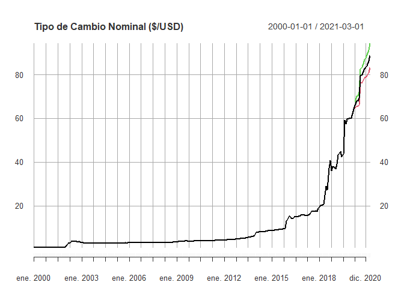
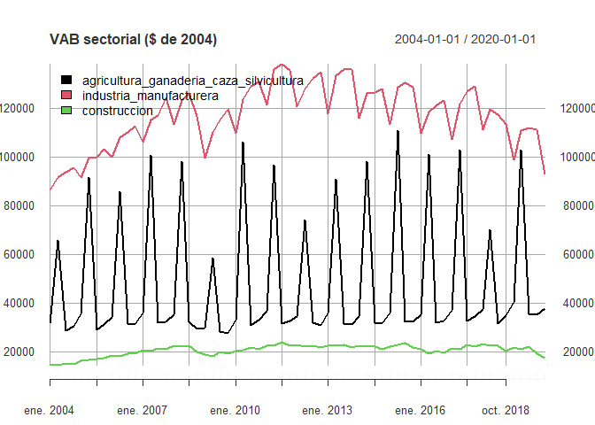

<!-- README.md is generated from README.Rmd. Please edit that file -->
<!-- badges: start -->

[](https://cran.r-project.org/package=PortalHacienda)
[](https://lifecycle.r-lib.org/articles/stages.html#experimental)
[](https://doi.org/10.5281/zenodo.3893947)
[](https://cran.r-project.org/package=PortalHacienda)
[](https://github.com/fmgarciadiaz/PortalHacienda-CRAN/actions/workflows/R-CMD-check.yaml)
<!-- badges: end -->

# PortalHacienda 

Un paquete de interfase a la API del Portal de Datos del Ministerio de
Hacienda

- **Buscar** series en la descripción de los meta-datos
- **Descargar** las series directamente de la API del Portal
- **Extender y proyectar** rápidamente series descargadas (funcionalidad
  muy básica)

## Instalación

Para instalar el paquete desde [CRAN](https://CRAN.R-project.org) con:

``` r
install.packages("PortalHacienda")
```

Instalar versión de desarrollo:

``` r
# install.packages("devtools")
devtools::install_github("fmgarciadiaz/PortalHacienda-CRAN")
```

**Nota**: Debe instalarse previamente el paquete `devtools` para
permitir la descarga desde `github`.

## Ejemplo

Búsqueda de series en la base de meta-datos online con `Search_online`.

``` r
# Cargar el paquete
library(PortalHacienda)
#> =============================================================================
#> Acceso API Portal Datos Hacienda - v 0.1.7 - 06-2023 por F.García Díaz
# Buscar series relacionadas con el tipo de cambio
Series_TCN <- Search_online("tipo de cambio")
#> Downloading time-series database...
#>   |                                                                              |                                                                      |   0%  |                                                                              |                                                                      |   1%  |                                                                              |=                                                                     |   1%  |                                                                              |=                                                                     |   2%  |                                                                              |==                                                                    |   2%  |                                                                              |==                                                                    |   3%  |                                                                              |==                                                                    |   4%  |                                                                              |===                                                                   |   4%  |                                                                              |====                                                                  |   5%  |                                                                              |====                                                                  |   6%  |                                                                              |=====                                                                 |   6%  |                                                                              |=====                                                                 |   7%  |                                                                              |=====                                                                 |   8%  |                                                                              |======                                                                |   8%  |                                                                              |======                                                                |   9%  |                                                                              |=======                                                               |   9%  |                                                                              |=======                                                               |  10%  |                                                                              |=======                                                               |  11%  |                                                                              |========                                                              |  11%  |                                                                              |========                                                              |  12%  |                                                                              |=========                                                             |  12%  |                                                                              |=========                                                             |  13%  |                                                                              |=========                                                             |  14%  |                                                                              |==========                                                            |  14%  |                                                                              |==========                                                            |  15%  |                                                                              |===========                                                           |  15%  |                                                                              |===========                                                           |  16%  |                                                                              |============                                                          |  16%  |                                                                              |============                                                          |  17%  |                                                                              |============                                                          |  18%  |                                                                              |=============                                                         |  18%  |                                                                              |=============                                                         |  19%  |                                                                              |==============                                                        |  19%  |                                                                              |==============                                                        |  20%  |                                                                              |==============                                                        |  21%  |                                                                              |===============                                                       |  21%  |                                                                              |===============                                                       |  22%  |                                                                              |================                                                      |  22%  |                                                                              |================                                                      |  23%  |                                                                              |=================                                                     |  24%  |                                                                              |=================                                                     |  25%  |                                                                              |==================                                                    |  25%  |                                                                              |==================                                                    |  26%  |                                                                              |===================                                                   |  27%  |                                                                              |===================                                                   |  28%  |                                                                              |====================                                                  |  28%  |                                                                              |====================                                                  |  29%  |                                                                              |=====================                                                 |  29%  |                                                                              |=====================                                                 |  30%  |                                                                              |=====================                                                 |  31%  |                                                                              |======================                                                |  31%  |                                                                              |======================                                                |  32%  |                                                                              |=======================                                               |  32%  |                                                                              |=======================                                               |  33%  |                                                                              |========================                                              |  34%  |                                                                              |========================                                              |  35%  |                                                                              |=========================                                             |  35%  |                                                                              |=========================                                             |  36%  |                                                                              |==========================                                            |  36%  |                                                                              |==========================                                            |  37%  |                                                                              |==========================                                            |  38%  |                                                                              |===========================                                           |  38%  |                                                                              |===========================                                           |  39%  |                                                                              |============================                                          |  39%  |                                                                              |============================                                          |  40%  |                                                                              |============================                                          |  41%  |                                                                              |=============================                                         |  41%  |                                                                              |=============================                                         |  42%  |                                                                              |==============================                                        |  42%  |                                                                              |==============================                                        |  43%  |                                                                              |===============================                                       |  44%  |                                                                              |===============================                                       |  45%  |                                                                              |================================                                      |  45%  |                                                                              |================================                                      |  46%  |                                                                              |=================================                                     |  46%  |                                                                              |=================================                                     |  47%  |                                                                              |=================================                                     |  48%  |                                                                              |==================================                                    |  48%  |                                                                              |==================================                                    |  49%  |                                                                              |===================================                                   |  49%  |                                                                              |===================================                                   |  50%  |                                                                              |===================================                                   |  51%  |                                                                              |====================================                                  |  51%  |                                                                              |======================================                                |  55%  |                                                                              |=======================================                               |  55%  |                                                                              |=======================================                               |  56%  |                                                                              |========================================                              |  57%  |                                                                              |========================================                              |  58%  |                                                                              |=========================================                             |  58%  |                                                                              |=========================================                             |  59%  |                                                                              |==========================================                            |  59%  |                                                                              |==========================================                            |  60%  |                                                                              |==========================================                            |  61%  |                                                                              |===========================================                           |  61%  |                                                                              |===========================================                           |  62%  |                                                                              |============================================                          |  62%  |                                                                              |============================================                          |  63%  |                                                                              |=============================================                         |  64%  |                                                                              |=============================================                         |  65%  |                                                                              |==============================================                        |  65%  |                                                                              |==============================================                        |  66%  |                                                                              |===============================================                       |  67%  |                                                                              |===============================================                       |  68%  |                                                                              |================================================                      |  68%  |                                                                              |================================================                      |  69%  |                                                                              |=================================================                     |  69%  |                                                                              |=================================================                     |  70%  |                                                                              |=================================================                     |  71%  |                                                                              |==================================================                    |  71%  |                                                                              |==================================================                    |  72%  |                                                                              |===================================================                   |  72%  |                                                                              |===================================================                   |  73%  |                                                                              |====================================================                  |  74%  |                                                                              |====================================================                  |  75%  |                                                                              |=====================================================                 |  75%  |                                                                              |=====================================================                 |  76%  |                                                                              |======================================================                |  77%  |                                                                              |======================================================                |  78%  |                                                                              |=======================================================               |  78%  |                                                                              |=======================================================               |  79%  |                                                                              |========================================================              |  79%  |                                                                              |========================================================              |  80%  |                                                                              |========================================================              |  81%  |                                                                              |=========================================================             |  81%  |                                                                              |=========================================================             |  82%  |                                                                              |==========================================================            |  82%  |                                                                              |==========================================================            |  83%  |                                                                              |==========================================================            |  84%  |                                                                              |===========================================================           |  84%  |                                                                              |===========================================================           |  85%  |                                                                              |============================================================          |  85%  |                                                                              |============================================================          |  86%  |                                                                              |=============================================================         |  87%  |                                                                              |=============================================================         |  88%  |                                                                              |==============================================================        |  88%  |                                                                              |==============================================================        |  89%  |                                                                              |===============================================================       |  89%  |                                                                              |===============================================================       |  90%  |                                                                              |===============================================================       |  91%  |                                                                              |================================================================      |  91%  |                                                                              |================================================================      |  92%  |                                                                              |=================================================================     |  92%  |                                                                              |=================================================================     |  93%  |                                                                              |==================================================================    |  94%  |                                                                              |==================================================================    |  95%  |                                                                              |===================================================================   |  95%  |                                                                              |===================================================================   |  96%  |                                                                              |====================================================================  |  97%  |                                                                              |====================================================================  |  98%  |                                                                              |===================================================================== |  98%  |                                                                              |===================================================================== |  99%  |                                                                              |======================================================================|  99%  |                                                                              |======================================================================| 100%
# Borrar la columna de links que devuelve la búsqueda y un par más
Series_TCN$distribucion_url_descarga <- NULL
Series_TCN$dataset_id <- NULL
Series_TCN$dataset_descripcion <- NULL
# mostrar prieras tres líneas de la tabla
kableExtra::kable_styling(knitr::kable(head(Series_TCN,3) ,"html"), 
                          font_size = 6,
                          bootstrap_options = c("striped", "hover", "condensed", "responsive"),fixed_thead = T)    
```

<table class="table table-striped table-hover table-condensed table-responsive" style="font-size: 6px; margin-left: auto; margin-right: auto;">
<thead>
<tr>
<th style="text-align:left;position: sticky; top:0; background-color: #FFFFFF;">
catalogo_id
</th>
<th style="text-align:right;position: sticky; top:0; background-color: #FFFFFF;">
distribucion_id
</th>
<th style="text-align:left;position: sticky; top:0; background-color: #FFFFFF;">
serie_id
</th>
<th style="text-align:left;position: sticky; top:0; background-color: #FFFFFF;">
indice_tiempo_frecuencia
</th>
<th style="text-align:left;position: sticky; top:0; background-color: #FFFFFF;">
serie_titulo
</th>
<th style="text-align:left;position: sticky; top:0; background-color: #FFFFFF;">
serie_unidades
</th>
<th style="text-align:left;position: sticky; top:0; background-color: #FFFFFF;">
serie_descripcion
</th>
<th style="text-align:left;position: sticky; top:0; background-color: #FFFFFF;">
distribucion_titulo
</th>
<th style="text-align:left;position: sticky; top:0; background-color: #FFFFFF;">
distribucion_descripcion
</th>
<th style="text-align:left;position: sticky; top:0; background-color: #FFFFFF;">
dataset_responsable
</th>
<th style="text-align:left;position: sticky; top:0; background-color: #FFFFFF;">
dataset_fuente
</th>
<th style="text-align:left;position: sticky; top:0; background-color: #FFFFFF;">
dataset_titulo
</th>
<th style="text-align:left;position: sticky; top:0; background-color: #FFFFFF;">
dataset_tema
</th>
<th style="text-align:left;position: sticky; top:0; background-color: #FFFFFF;">
serie_indice_inicio
</th>
<th style="text-align:left;position: sticky; top:0; background-color: #FFFFFF;">
serie_indice_final
</th>
<th style="text-align:right;position: sticky; top:0; background-color: #FFFFFF;">
serie_valores_cant
</th>
<th style="text-align:right;position: sticky; top:0; background-color: #FFFFFF;">
serie_dias_no_cubiertos
</th>
<th style="text-align:left;position: sticky; top:0; background-color: #FFFFFF;">
serie_actualizada
</th>
<th style="text-align:right;position: sticky; top:0; background-color: #FFFFFF;">
serie_valor_ultimo
</th>
<th style="text-align:right;position: sticky; top:0; background-color: #FFFFFF;">
serie_valor_anterior
</th>
<th style="text-align:right;position: sticky; top:0; background-color: #FFFFFF;">
serie_var_pct_anterior
</th>
</tr>
</thead>
<tbody>
<tr>
<td style="text-align:left;">
siep
</td>
<td style="text-align:right;">
1.1
</td>
<td style="text-align:left;">
tcrse_2weZeH
</td>
<td style="text-align:left;">
R/P1M
</td>
<td style="text-align:left;">
tcrse_alimentos
</td>
<td style="text-align:left;">
Índice - Base Noviembre 2015=100
</td>
<td style="text-align:left;">
Índice de Tipo de Cambio Real Sectorial Efectivo. Producción y
procesamiento de alimentos
</td>
<td style="text-align:left;">
Índice de Tipo de Cambio Real Sectorial Efectivo (series)
</td>
<td style="text-align:left;">
Índice de Tipo de Cambio Real Sectorial Efectivo en formato de series de
tiempo
</td>
<td style="text-align:left;">
Ministerio de Producción. Secretaría de Transformación Productiva.
Subsecretaría de Desarrollo y Planeamiento Productivo.
</td>
<td style="text-align:left;">
Ministerio de Producción. Secretaría de la Transformación Productiva.
Subsecretaría de Desarrollo y Planeamiento Productivo.
</td>
<td style="text-align:left;">
Índice de Tipo de Cambio Real Sectorial Efectivo
</td>
<td style="text-align:left;">
Sector Externo
</td>
<td style="text-align:left;">
2014-01-01
</td>
<td style="text-align:left;">
2018-07-01
</td>
<td style="text-align:right;">
55
</td>
<td style="text-align:right;">
51
</td>
<td style="text-align:left;">
TRUE
</td>
<td style="text-align:right;">
156.4
</td>
<td style="text-align:right;">
155.6
</td>
<td style="text-align:right;">
0.0051414
</td>
</tr>
<tr>
<td style="text-align:left;">
siep
</td>
<td style="text-align:right;">
1.1
</td>
<td style="text-align:left;">
tcrse_49xDd3
</td>
<td style="text-align:left;">
R/P1M
</td>
<td style="text-align:left;">
tcrse_impresion
</td>
<td style="text-align:left;">
Índice - Base Noviembre 2015=100
</td>
<td style="text-align:left;">
Índice de Tipo de Cambio Real Sectorial Efectivo. Actividades de
impresión
</td>
<td style="text-align:left;">
Índice de Tipo de Cambio Real Sectorial Efectivo (series)
</td>
<td style="text-align:left;">
Índice de Tipo de Cambio Real Sectorial Efectivo en formato de series de
tiempo
</td>
<td style="text-align:left;">
Ministerio de Producción. Secretaría de Transformación Productiva.
Subsecretaría de Desarrollo y Planeamiento Productivo.
</td>
<td style="text-align:left;">
Ministerio de Producción. Secretaría de la Transformación Productiva.
Subsecretaría de Desarrollo y Planeamiento Productivo.
</td>
<td style="text-align:left;">
Índice de Tipo de Cambio Real Sectorial Efectivo
</td>
<td style="text-align:left;">
Sector Externo
</td>
<td style="text-align:left;">
2014-01-01
</td>
<td style="text-align:left;">
2018-07-01
</td>
<td style="text-align:right;">
55
</td>
<td style="text-align:right;">
51
</td>
<td style="text-align:left;">
TRUE
</td>
<td style="text-align:right;">
155.9
</td>
<td style="text-align:right;">
155.7
</td>
<td style="text-align:right;">
0.0012845
</td>
</tr>
<tr>
<td style="text-align:left;">
siep
</td>
<td style="text-align:right;">
1.1
</td>
<td style="text-align:left;">
tcrse_4sgTaJ
</td>
<td style="text-align:left;">
R/P1M
</td>
<td style="text-align:left;">
tcrse_cuero
</td>
<td style="text-align:left;">
Índice - Base Noviembre 2015=100
</td>
<td style="text-align:left;">
Índice de Tipo de Cambio Real Sectorial Efectivo. Productos del cuero
</td>
<td style="text-align:left;">
Índice de Tipo de Cambio Real Sectorial Efectivo (series)
</td>
<td style="text-align:left;">
Índice de Tipo de Cambio Real Sectorial Efectivo en formato de series de
tiempo
</td>
<td style="text-align:left;">
Ministerio de Producción. Secretaría de Transformación Productiva.
Subsecretaría de Desarrollo y Planeamiento Productivo.
</td>
<td style="text-align:left;">
Ministerio de Producción. Secretaría de la Transformación Productiva.
Subsecretaría de Desarrollo y Planeamiento Productivo.
</td>
<td style="text-align:left;">
Índice de Tipo de Cambio Real Sectorial Efectivo
</td>
<td style="text-align:left;">
Sector Externo
</td>
<td style="text-align:left;">
2014-01-01
</td>
<td style="text-align:left;">
2018-07-01
</td>
<td style="text-align:right;">
55
</td>
<td style="text-align:right;">
51
</td>
<td style="text-align:left;">
TRUE
</td>
<td style="text-align:right;">
151.7
</td>
<td style="text-align:right;">
151.0
</td>
<td style="text-align:right;">
0.0046358
</td>
</tr>
</tbody>
</table>

Bajar serie de tipo de cambio con `Get` y extender 12 períodos con
`Forecast` (usa modelo auto-detectado del paquete ***forecast*** y
extiende según la frecuencia detectada, días, meses o años). Luego hacer
un plot sencillo.

``` r

TCN <- Forecast(Get("174.1_T_DE_CATES_0_0_32" , start_date = 2000), 12)       
#> Downloading data series...
#> Loaded 279 data points, from 2000-01-01 to 2023-03-01. Periodicity: monthly
#> Registered S3 method overwritten by 'quantmod':
#>   method            from
#>   as.zoo.data.frame zoo
#> Warning in .check_tzones(e1, e2): 'tzone' attributes are inconsistent
#> Time-series extended 12 data points, using auto-detected model: ARIMA(0,2,3)(0,0,1)[12]
# Mostrar resultado
plot(TCN , main = "Tipo de Cambio Nominal ($/USD)")
```



También se pueden obtener varias series al mismo tiempo, separando con
comas…

``` r
plot(Get("6.2_AGCS_2004_T_39,6.2_IM_2004_T_23,6.2_C_2004_T_12") , legend.loc = "topleft" , main = "VAB sectorial ($ de 2004)")
#> Downloading data series...
#> Loaded 228 data points, from 2004-01-01 to 2022-10-01. Periodicity: quarterly
```



En caso de cargar varias series y desear proyecciones automáticas,
utilizar la variante vectorial de `Forecast`, que es `vForecast`:

``` r
TCN <- vForecast(Get("120.1_PCE_1993_0_24,120.1_ED1_1993_0_26"),12)
#> Downloading data series...
#> Loaded 70 data points, from 1986-01-01 to 2020-01-01. Periodicity: yearly
#> Warning in .check_tzones(e1, e2): 'tzone' attributes are inconsistent
#> Time-series extended 12 data points, using auto-detected models
```

### Nota:

Las series se cargan en formato XTS, con la periodicidad auto-detectada
por el paquete `xts`. La periocidiad es usada por la función `Forecast`
para correcta detección de *estacionalidad* y *lags*. `Forecast` agrega
demás intervalos de confianza del 95%.

## Cómo citar

> Fernando García Díaz. (2020, June 14).
> fmgarciadiaz/PortalHacienda-CRAN.
> <https://doi.org/10.5281/zenodo.3893947>

## Estado del Proyecto

- [x] Aprobado en CRAN!
- [x] Funcionalidad *básica*
- [x] Captura de errores - conexión de internet, errores devueltos por
  la API, timeout, etc.
- [x] Mejorar la documentación
- [ ] Mejora de la función Search_online (i.e. evitar una descarga por
  búsqueda)
