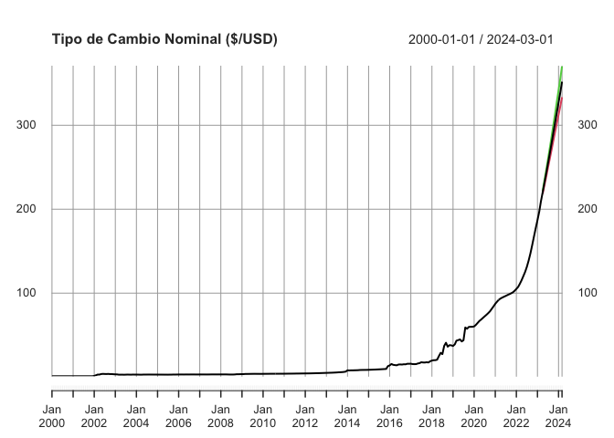
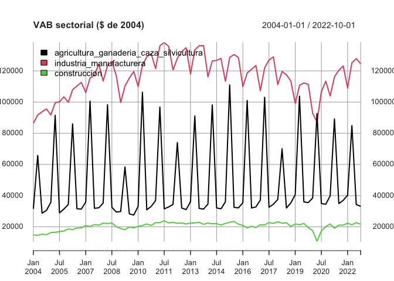

<!-- README.md is generated from README.Rmd. Please edit that file -->

<!-- badges: start -->

[](https://cran.r-project.org/package=PortalHacienda)
[](https://www.tidyverse.org/lifecycle/#experimental)
[](https://github.com/fmgarciadiaz/PortalHacienda-CRAN/actions)
[](https://zenodo.org/badge/latestdoi/266652798)
[](https://cran.r-project.org/package=PortalHacienda)

<!-- badges: end -->

# PortalHacienda 

Un paquete de interfase a la API del Portal de Datos del Ministerio de
Hacienda

  - **Buscar** series en la descripción de los meta-datos
  - **Descargar** las series directamente de la API del Portal
  - **Extender y proyectar** rápidamente series descargadas
    (funcionalidad muy básica)

## Instalación

Para instalar el paquete desde [CRAN](https://CRAN.R-project.org) con:

``` r
install.packages("PortalHacienda")
```

Instalar versión de desarrollo:

``` r
# install.packages("devtools")
devtools::install_github("fmgarciadiaz/PortalHacienda")
```

**Nota**: Debe instalarse previamente el paquete `devtools` para
permitir la descarga desde `github`.

## Ejemplo

Búsqueda de series en la base de meta-datos online con `Search_online`.

``` r
# Cargar el paquete
library(PortalHacienda)
#> =============================================================================
#> Acceso API Portal Datos Hacienda - v 0.1.3 - 06-2020 por F.García Díaz
# Buscar series relacionadas con el tipo de cambio
Series_TCN <- Search_online("tipo de cambio")
#> Downloading time-series database...
# Borrar la columna de links que devuelve la búsqueda 
Series_TCN$distribucion_url_descarga <- NULL
# mostrar prieras tres líneas de la tabla
kableExtra::kable_styling(knitr::kable(head(Series_TCN,3) ,"html"), font_size = 6)    
```

<table class="table" style="font-size: 6px; margin-left: auto; margin-right: auto;">

<thead>

<tr>

<th style="text-align:left;">

catalogo\_id

</th>

<th style="text-align:right;">

dataset\_id

</th>

<th style="text-align:right;">

distribucion\_id

</th>

<th style="text-align:left;">

serie\_id

</th>

<th style="text-align:left;">

indice\_tiempo\_frecuencia

</th>

<th style="text-align:left;">

serie\_titulo

</th>

<th style="text-align:left;">

serie\_unidades

</th>

<th style="text-align:left;">

serie\_descripcion

</th>

<th style="text-align:left;">

distribucion\_titulo

</th>

<th style="text-align:left;">

distribucion\_descripcion

</th>

<th style="text-align:left;">

dataset\_responsable

</th>

<th style="text-align:left;">

dataset\_fuente

</th>

<th style="text-align:left;">

dataset\_titulo

</th>

<th style="text-align:left;">

dataset\_descripcion

</th>

<th style="text-align:left;">

dataset\_tema

</th>

<th style="text-align:left;">

serie\_indice\_inicio

</th>

<th style="text-align:left;">

serie\_indice\_final

</th>

<th style="text-align:right;">

serie\_valores\_cant

</th>

<th style="text-align:right;">

serie\_dias\_no\_cubiertos

</th>

<th style="text-align:left;">

serie\_actualizada

</th>

<th style="text-align:right;">

serie\_valor\_ultimo

</th>

<th style="text-align:right;">

serie\_valor\_anterior

</th>

<th style="text-align:right;">

serie\_var\_pct\_anterior

</th>

</tr>

</thead>

<tbody>

<tr>

<td style="text-align:left;">

siep

</td>

<td style="text-align:right;">

1

</td>

<td style="text-align:right;">

1.1

</td>

<td style="text-align:left;">

tcrse\_2weZeH

</td>

<td style="text-align:left;">

R/P1M

</td>

<td style="text-align:left;">

tcrse\_alimentos

</td>

<td style="text-align:left;">

Índice - Base Noviembre 2015=100

</td>

<td style="text-align:left;">

Índice de Tipo de Cambio Real Sectorial Efectivo. Producción y
procesamiento de alimentos

</td>

<td style="text-align:left;">

Índice de Tipo de Cambio Real Sectorial Efectivo (series)

</td>

<td style="text-align:left;">

Índice de Tipo de Cambio Real Sectorial Efectivo en formato de series de
tiempo

</td>

<td style="text-align:left;">

Ministerio de Producción. Secretaría de Transformación Productiva.
Subsecretaría de Desarrollo y Planeamiento Productivo.

</td>

<td style="text-align:left;">

Ministerio de Producción. Secretaría de la Transformación Productiva.
Subsecretaría de Desarrollo y Planeamiento Productivo.

</td>

<td style="text-align:left;">

Índice de Tipo de Cambio Real Sectorial Efectivo

</td>

<td style="text-align:left;">

Indicador sectorial elaborado por la Secretaría de la Transformación
Productiva para ajustar el índice de tipo de cambio real multilateral
específico de cada sector por las exportaciones de países competidores y
por reintegros y derechos de exportación.

</td>

<td style="text-align:left;">

Sector Externo

</td>

<td style="text-align:left;">

2014-01-01

</td>

<td style="text-align:left;">

2018-07-01

</td>

<td style="text-align:right;">

55

</td>

<td style="text-align:right;">

51

</td>

<td style="text-align:left;">

TRUE

</td>

<td style="text-align:right;">

156.4

</td>

<td style="text-align:right;">

155.6

</td>

<td style="text-align:right;">

0.0051414

</td>

</tr>

<tr>

<td style="text-align:left;">

siep

</td>

<td style="text-align:right;">

1

</td>

<td style="text-align:right;">

1.1

</td>

<td style="text-align:left;">

tcrse\_49xDd3

</td>

<td style="text-align:left;">

R/P1M

</td>

<td style="text-align:left;">

tcrse\_impresion

</td>

<td style="text-align:left;">

Índice - Base Noviembre 2015=100

</td>

<td style="text-align:left;">

Índice de Tipo de Cambio Real Sectorial Efectivo. Actividades de
impresión

</td>

<td style="text-align:left;">

Índice de Tipo de Cambio Real Sectorial Efectivo (series)

</td>

<td style="text-align:left;">

Índice de Tipo de Cambio Real Sectorial Efectivo en formato de series de
tiempo

</td>

<td style="text-align:left;">

Ministerio de Producción. Secretaría de Transformación Productiva.
Subsecretaría de Desarrollo y Planeamiento Productivo.

</td>

<td style="text-align:left;">

Ministerio de Producción. Secretaría de la Transformación Productiva.
Subsecretaría de Desarrollo y Planeamiento Productivo.

</td>

<td style="text-align:left;">

Índice de Tipo de Cambio Real Sectorial Efectivo

</td>

<td style="text-align:left;">

Indicador sectorial elaborado por la Secretaría de la Transformación
Productiva para ajustar el índice de tipo de cambio real multilateral
específico de cada sector por las exportaciones de países competidores y
por reintegros y derechos de exportación.

</td>

<td style="text-align:left;">

Sector Externo

</td>

<td style="text-align:left;">

2014-01-01

</td>

<td style="text-align:left;">

2018-07-01

</td>

<td style="text-align:right;">

55

</td>

<td style="text-align:right;">

51

</td>

<td style="text-align:left;">

TRUE

</td>

<td style="text-align:right;">

155.9

</td>

<td style="text-align:right;">

155.7

</td>

<td style="text-align:right;">

0.0012845

</td>

</tr>

<tr>

<td style="text-align:left;">

siep

</td>

<td style="text-align:right;">

1

</td>

<td style="text-align:right;">

1.1

</td>

<td style="text-align:left;">

tcrse\_4sgTaJ

</td>

<td style="text-align:left;">

R/P1M

</td>

<td style="text-align:left;">

tcrse\_cuero

</td>

<td style="text-align:left;">

Índice - Base Noviembre 2015=100

</td>

<td style="text-align:left;">

Índice de Tipo de Cambio Real Sectorial Efectivo. Productos del cuero

</td>

<td style="text-align:left;">

Índice de Tipo de Cambio Real Sectorial Efectivo (series)

</td>

<td style="text-align:left;">

Índice de Tipo de Cambio Real Sectorial Efectivo en formato de series de
tiempo

</td>

<td style="text-align:left;">

Ministerio de Producción. Secretaría de Transformación Productiva.
Subsecretaría de Desarrollo y Planeamiento Productivo.

</td>

<td style="text-align:left;">

Ministerio de Producción. Secretaría de la Transformación Productiva.
Subsecretaría de Desarrollo y Planeamiento Productivo.

</td>

<td style="text-align:left;">

Índice de Tipo de Cambio Real Sectorial Efectivo

</td>

<td style="text-align:left;">

Indicador sectorial elaborado por la Secretaría de la Transformación
Productiva para ajustar el índice de tipo de cambio real multilateral
específico de cada sector por las exportaciones de países competidores y
por reintegros y derechos de exportación.

</td>

<td style="text-align:left;">

Sector Externo

</td>

<td style="text-align:left;">

2014-01-01

</td>

<td style="text-align:left;">

2018-07-01

</td>

<td style="text-align:right;">

55

</td>

<td style="text-align:right;">

51

</td>

<td style="text-align:left;">

TRUE

</td>

<td style="text-align:right;">

151.7

</td>

<td style="text-align:right;">

151.0

</td>

<td style="text-align:right;">

0.0046358

</td>

</tr>

</tbody>

</table>

Bajar serie de tipo de cambio con `Get` y extender 12 períodos con
`Forecast` (usa modelo auto-detectado del paquete ***forecast*** y
extiende según la frecuencia detectada, días, meses o años). Luego hacer
un plot sencillo.

``` r

TCN <- Forecast(Get("174.1_T_DE_CATES_0_0_32" , start_date = 2000), 12)       
#> Downloading data series...
#> Loaded 243 data points, from 2000-01-01 to 2020-03-01. Periodicity: monthly
#> Registered S3 method overwritten by 'quantmod':
#>   method            from
#>   as.zoo.data.frame zoo
#> Time-series extended 12 data points, using auto-detected model: ARIMA(4,2,1)(0,0,2)[12]
# Mostrar resultado
plot(TCN , main = "Tipo de Cambio Nominal ($/USD)")
```



También se pueden obtener varias series al mismo tiempo, separando con
comas…

``` r
plot(Get("6.2_AGCS_2004_T_39,6.2_IM_2004_T_23,6.2_C_2004_T_12") , legend.loc = "topleft" , main = "VAB sectorial ($ de 2004)")
#> Downloading data series...
#> Loaded 192 data points, from 2004-01-01 to 2019-10-01. Periodicity: quarterly
```



En caso de cargar varias series y desear proyecciones automáticas,
utilizar la variante vectorial de `Forecast`, que es `vForecast`:

``` r
TCN <- vForecast(Get("120.1_PCE_1993_0_24,120.1_ED1_1993_0_26"),12)
#> Downloading data series...
#> Loaded 64 data points, from 1986-01-01 to 2017-01-01. Periodicity: yearly
#> Time-series extended 12 data points, using auto-detected models
```

### Nota:

Las series se cargan en formato XTS, con la periodicidad auto-detectada
por el paquete `xts`. La periocidiad es usada por la función `Forecast`
para correcta detección de *estacionalidad* y *lags*. `Forecast` agrega
demás intervalos de confianza del 95%. Las series diarias tienen un tope
de **1000** datos (dado el límite actual de la API)

## Cómo citar

> Fernando García Díaz. (2020, June 14). fmgarciadiaz/PortalHacienda.
> Zenodo. <http://doi.org/10.5281/zenodo.3893947>

## Estado del Proyecto

  - [x] Aprobado en CRAN\!
  - [x] Funcionalidad *básica*
  - [x] Captura de errores de uso o en la devolución de datos (básico)
  - [ ] Captura de errores detallada
  - [ ] Mejorar la documentación
  - [ ] Mejora de la función Search\_online (i.e. evitar una descarga
    por búsqueda)
