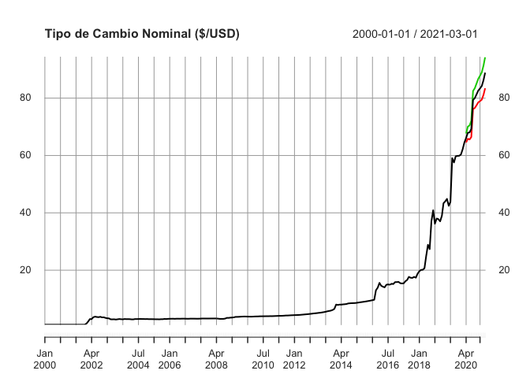

<!-- README.md is generated from README.Rmd. Please edit that file -->


# PortalHacienda

Un paquete de interfase a la API del Portal de Datos del Ministerio de Hacienda

- **Buscar** series en la descripción de los meta-datos
- **Descargar** las series directamente de la API del Portal
- **Extender y proyectar** rápidamente series descargadas (funcionalidad muy básica) 


## Instalación

Para instalar el paquete en R ejecutar:


```r
# Stable
# install.packages("PortalHacienda")
# Development
# install.packages("devtools")
# devtools::install_github("fmgarciadiaz/PortalHacienda")
```

**Nota**: Debe instalarse previamente el paquete `devtools` para permitir la descarga desde `github`.

## Ejemplo

Búsqueda de series **(a)** en el listado incluído en el paquete con `Search` o **(b)** en la base online con 
`Search_online`.


```r
# Cargar el paquete
library(PortalHacienda)
#> =============================================================================
#> Acceso API Portal Datos Hacienda - v 0.1.0 - 05-2020 por F.García Díaz
library(magrittr)
# mostrar las primeras series encontradas
Series_TCN <- Search_online("tipo de cambio")         
#> Descagando base de metadatos...
knitr::kable(head(Series_TCN,3) ,"html") %>% kableExtra::kable_styling(font_size = 7)    
```

<table class="table" style="font-size: 7px; margin-left: auto; margin-right: auto;">
 <thead>
  <tr>
   <th style="text-align:left;"> catalogo_id </th>
   <th style="text-align:right;"> dataset_id </th>
   <th style="text-align:right;"> distribucion_id </th>
   <th style="text-align:left;"> serie_id </th>
   <th style="text-align:left;"> indice_tiempo_frecuencia </th>
   <th style="text-align:left;"> serie_titulo </th>
   <th style="text-align:left;"> serie_unidades </th>
   <th style="text-align:left;"> serie_descripcion </th>
   <th style="text-align:left;"> distribucion_titulo </th>
   <th style="text-align:left;"> distribucion_descripcion </th>
   <th style="text-align:left;"> distribucion_url_descarga </th>
   <th style="text-align:left;"> dataset_responsable </th>
   <th style="text-align:left;"> dataset_fuente </th>
   <th style="text-align:left;"> dataset_titulo </th>
   <th style="text-align:left;"> dataset_descripcion </th>
   <th style="text-align:left;"> dataset_tema </th>
   <th style="text-align:left;"> serie_indice_inicio </th>
   <th style="text-align:left;"> serie_indice_final </th>
   <th style="text-align:right;"> serie_valores_cant </th>
   <th style="text-align:right;"> serie_dias_no_cubiertos </th>
   <th style="text-align:left;"> serie_actualizada </th>
   <th style="text-align:right;"> serie_valor_ultimo </th>
   <th style="text-align:right;"> serie_valor_anterior </th>
   <th style="text-align:right;"> serie_var_pct_anterior </th>
  </tr>
 </thead>
<tbody>
  <tr>
   <td style="text-align:left;"> siep </td>
   <td style="text-align:right;"> 1 </td>
   <td style="text-align:right;"> 1.1 </td>
   <td style="text-align:left;"> tcrse_2weZeH </td>
   <td style="text-align:left;"> R/P1M </td>
   <td style="text-align:left;"> tcrse_alimentos </td>
   <td style="text-align:left;"> Índice - Base Noviembre 2015=100 </td>
   <td style="text-align:left;"> Índice de Tipo de Cambio Real Sectorial Efectivo. Producción y procesamiento  de alimentos </td>
   <td style="text-align:left;"> Índice de Tipo de Cambio Real Sectorial Efectivo (series) </td>
   <td style="text-align:left;"> Índice de Tipo de Cambio Real Sectorial Efectivo en formato de series de tiempo </td>
   <td style="text-align:left;"> http://estadisticas.produccion.gob.ar/dataset/1/distribution/1.1/tcrmse-series.csv </td>
   <td style="text-align:left;"> Ministerio de Producción. Secretaría de Transformación Productiva. Subsecretaría de Desarrollo y Planeamiento Productivo. </td>
   <td style="text-align:left;"> Ministerio de Producción. Secretaría de la Transformación Productiva. Subsecretaría de Desarrollo y Planeamiento Productivo. </td>
   <td style="text-align:left;"> Índice de Tipo de Cambio Real Sectorial Efectivo </td>
   <td style="text-align:left;"> Indicador sectorial elaborado por la Secretaría de la Transformación Productiva para ajustar el índice de tipo de cambio real multilateral específico de cada sector por las exportaciones de países competidores y por reintegros y derechos de exportación. </td>
   <td style="text-align:left;"> Sector Externo </td>
   <td style="text-align:left;"> 2014-01-01 </td>
   <td style="text-align:left;"> 2018-07-01 </td>
   <td style="text-align:right;"> 55 </td>
   <td style="text-align:right;"> 51 </td>
   <td style="text-align:left;"> TRUE </td>
   <td style="text-align:right;"> 156.4 </td>
   <td style="text-align:right;"> 155.6 </td>
   <td style="text-align:right;"> 0.0051414 </td>
  </tr>
  <tr>
   <td style="text-align:left;"> siep </td>
   <td style="text-align:right;"> 1 </td>
   <td style="text-align:right;"> 1.1 </td>
   <td style="text-align:left;"> tcrse_49xDd3 </td>
   <td style="text-align:left;"> R/P1M </td>
   <td style="text-align:left;"> tcrse_impresion </td>
   <td style="text-align:left;"> Índice - Base Noviembre 2015=100 </td>
   <td style="text-align:left;"> Índice de Tipo de Cambio Real Sectorial Efectivo. Actividades de impresión </td>
   <td style="text-align:left;"> Índice de Tipo de Cambio Real Sectorial Efectivo (series) </td>
   <td style="text-align:left;"> Índice de Tipo de Cambio Real Sectorial Efectivo en formato de series de tiempo </td>
   <td style="text-align:left;"> http://estadisticas.produccion.gob.ar/dataset/1/distribution/1.1/tcrmse-series.csv </td>
   <td style="text-align:left;"> Ministerio de Producción. Secretaría de Transformación Productiva. Subsecretaría de Desarrollo y Planeamiento Productivo. </td>
   <td style="text-align:left;"> Ministerio de Producción. Secretaría de la Transformación Productiva. Subsecretaría de Desarrollo y Planeamiento Productivo. </td>
   <td style="text-align:left;"> Índice de Tipo de Cambio Real Sectorial Efectivo </td>
   <td style="text-align:left;"> Indicador sectorial elaborado por la Secretaría de la Transformación Productiva para ajustar el índice de tipo de cambio real multilateral específico de cada sector por las exportaciones de países competidores y por reintegros y derechos de exportación. </td>
   <td style="text-align:left;"> Sector Externo </td>
   <td style="text-align:left;"> 2014-01-01 </td>
   <td style="text-align:left;"> 2018-07-01 </td>
   <td style="text-align:right;"> 55 </td>
   <td style="text-align:right;"> 51 </td>
   <td style="text-align:left;"> TRUE </td>
   <td style="text-align:right;"> 155.9 </td>
   <td style="text-align:right;"> 155.7 </td>
   <td style="text-align:right;"> 0.0012845 </td>
  </tr>
  <tr>
   <td style="text-align:left;"> siep </td>
   <td style="text-align:right;"> 1 </td>
   <td style="text-align:right;"> 1.1 </td>
   <td style="text-align:left;"> tcrse_4sgTaJ </td>
   <td style="text-align:left;"> R/P1M </td>
   <td style="text-align:left;"> tcrse_cuero </td>
   <td style="text-align:left;"> Índice - Base Noviembre 2015=100 </td>
   <td style="text-align:left;"> Índice de Tipo de Cambio Real Sectorial Efectivo. Productos del cuero </td>
   <td style="text-align:left;"> Índice de Tipo de Cambio Real Sectorial Efectivo (series) </td>
   <td style="text-align:left;"> Índice de Tipo de Cambio Real Sectorial Efectivo en formato de series de tiempo </td>
   <td style="text-align:left;"> http://estadisticas.produccion.gob.ar/dataset/1/distribution/1.1/tcrmse-series.csv </td>
   <td style="text-align:left;"> Ministerio de Producción. Secretaría de Transformación Productiva. Subsecretaría de Desarrollo y Planeamiento Productivo. </td>
   <td style="text-align:left;"> Ministerio de Producción. Secretaría de la Transformación Productiva. Subsecretaría de Desarrollo y Planeamiento Productivo. </td>
   <td style="text-align:left;"> Índice de Tipo de Cambio Real Sectorial Efectivo </td>
   <td style="text-align:left;"> Indicador sectorial elaborado por la Secretaría de la Transformación Productiva para ajustar el índice de tipo de cambio real multilateral específico de cada sector por las exportaciones de países competidores y por reintegros y derechos de exportación. </td>
   <td style="text-align:left;"> Sector Externo </td>
   <td style="text-align:left;"> 2014-01-01 </td>
   <td style="text-align:left;"> 2018-07-01 </td>
   <td style="text-align:right;"> 55 </td>
   <td style="text-align:right;"> 51 </td>
   <td style="text-align:left;"> TRUE </td>
   <td style="text-align:right;"> 151.7 </td>
   <td style="text-align:right;"> 151.0 </td>
   <td style="text-align:right;"> 0.0046358 </td>
  </tr>
</tbody>
</table>

Bajar serie de tipo de cambio con `Get` y extender 12 períodos con `Forecast` (usa modelo auto-detectado del paquete ***forecast*** y extiende según la frecuencia detectada, días, meses o años). 
Luego hacer un plot sencillo.


```r

TCN <- Forecast(Get("174.1_T_DE_CATES_0_0_32" , start_date = 2000), 12)       
#> Descagando series...
#> [1] "Cargada/s las series..."
#> [1] "Cargados 243 datos, desde 2000-01-01 hasta 2020-03-01 Periodicidad estimada: monthly"
#> Registered S3 method overwritten by 'quantmod':
#>   method            from
#>   as.zoo.data.frame zoo
#> [1] "Serie extendida 12 períodos, usando el modelo auto detectado: ARIMA(4,2,1)(0,0,2)[12]"
# Mostrar resultado
plot(TCN , main = "Tipo de Cambio Nominal ($/USD)")
```

<!-- -->

También se pueden obtener varias series al mismo tiempo, separando con comas...


```r
plot(Get("6.2_AGCS_2004_T_39,6.2_IM_2004_T_23,6.2_C_2004_T_12") , legend.loc = "topleft" , main = "VAB sectorial ($ de 2004)")
#> Descagando series...
#> [1] "Cargada/s las series..."
#> [1] "Cargados 192 datos, desde 2004-01-01 hasta 2019-10-01 Periodicidad estimada: quarterly"
```

<!-- -->

En caso de cargar varias series y desear proyecciones automáticas, utilizar la
variante vectorial de `Forecast`, que es `vForecast`:


```r
TCN <- vForecast(Get("120.1_PCE_1993_0_24,120.1_ED1_1993_0_26"),12)
#> Descagando series...
#> [1] "Cargada/s las series..."
#> [1] "Cargados 64 datos, desde 1986-01-01 hasta 2017-01-01 Periodicidad estimada: yearly"
#> [1] "Serie extendida 12 períodos, usando modelo auto detectado"
```

### Notas
Las series se cargan en formato XTS, con la periodicidad auto-detectada por el paquete `xts`.
La periocidiad es usada por la función `Forecast` para correcta detección de *estacionalidad* y *lags*. `Forecast` agrega demás intervalos de confianza del 95%.
Las series diarias tienen un tope de **1000** datos (dado el límite actual de la API)

# Estado del Proyecto

- [ ] Aprobado en CRAN
- [x] Funcionalidad *básica*
- [x] Captura de errores de uso o en la devolución de datos (básico)
- [ ] Captura de errores avanzada
- [ ] Otros
